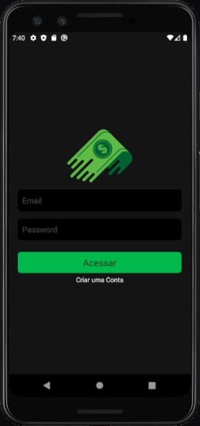
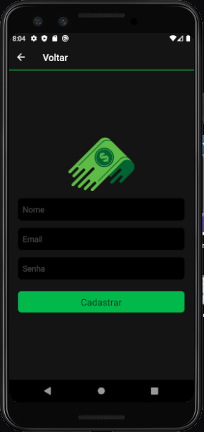

  
  <h1 align="center", font-size=40><b>Save Money<b/></h1>
   

<h4 >Esse projeto utiliza:</h4>
  
  <ul >
  <li>react-native</li>
  <li>firebase</li>
  <li>styled-components</li>
  <li>async-storage</li>
  </ul>

<h6><b>Abaixo é possivel ver algumas telas e uma breve descrição de como foi feito:</b></h6>

# SignIn

  

    
  

  

# SignUp

 

    
  

